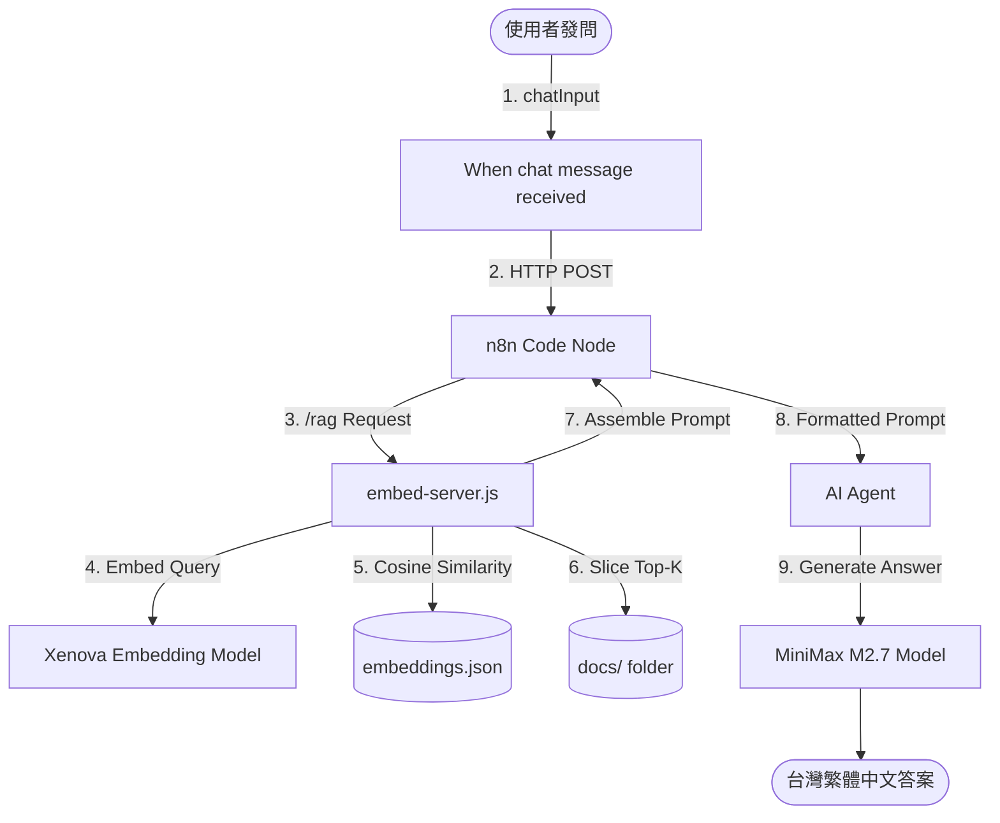

這是一份關於在 Kubernetes 本地化部署的 **n8n RAG (Retrieval-Augmented Generation) 知識庫問答系統** 架構說明文件。本系統專為在資源受限環境（如 8GB RAM 設備）下運行而設計，透過「離線建索引」與「線上輕量檢索」的分工機制，實現極低延遲且完全免費的本地向量檢索。

---

## 🏗️ 系統總覽與運作架構

本系統主要分為兩個核心階段：**離線建檔（Offline Indexing）** 與 **線上問答（Online Querying）**。

### 1. 離線建檔階段（Offline Indexing）
當知識庫文件（.md / .json）有更新時運行。將文字轉換為高維度的向量數據並儲存。

```mermaid
graph TD
    A[Scraped Docs (.md/.json)] --> B[Translate to zh-TW]
    B --> C[Read Docs Node]
    C --> D[embed-worker.js Batch Process]
    D -->|Xenova/MiniLM-L12-v2| E[Generate 384d Vectors]
    E --> F[(embeddings.json)]
```

### 2. 線上問答階段（Online Querying）
使用者發送問題時，系統進行實時檢索並由 LLM 生成回答。



---

## 🧩 核心模組細節

### A. 向量伺服器（embed-server.js）
運行於容器背景的輕量 Node.js HTTP 伺服器，負責所有重度 AI 推理與檔案 I/O：
- **模型**：`Xenova/paraphrase-multilingual-MiniLM-L12-v2`（384 維度，約 100MB，支持中英文跨語言檢索）。
- **API 接口**：
  - `POST /embed`：將單一字串轉換為向量。
  - `POST /rag`：接收使用者問題，在本地計算 Cosine Similarity，篩選出相關度最高的 3 個文件，各讀取前 1500 字，組裝成包含知識庫上下文的系統提示詞（Prompt）並回傳。
- **快取策略**：將 Hugging Face 模型快取掛載至 Host 實體磁碟，重啟無需重新下載模型。

### B. n8n 工作流協調（n8n Workflow）
- **問答觸發器**：使用 LangChain 的 `Chat Trigger`，提供網頁 Fullscreen Chat 互動介面。
- **連接器（Code Node）**：僅需發送一個簡單的異步 HTTP 請求給本地的 `embed-server`，獲取組裝好的 RAG 提示詞。
- **推理代理**：LangChain `AI Agent` 連接 `MiniMax-M2.7` 模型，以高性價比、流暢的台灣繁體中文輸出最終答案。

---

## 💡 為什麼要這樣設計？（設計考量）

1. **繞過 n8n 沙箱限制**：n8n 內建的 JS 執行環境（Task Runner）運行在嚴格的 `isolated-vm` 中，不允許使用部分 Node 原生 API（如 `fs`），且不支援 ESM 模組（導致無法直接導入 `@xenova/transformers`）。將邏輯移至外部服務（`embed-server`）徹底解決了沙箱衝突。
2. **解決 CPU 與記憶體逾時**：在沙箱中運算 126 個向量的相似度會大量佔用單執行緒 CPU，導致 n8n 認為 Task Runner 失去心跳而中斷。外部 Node.js 進程運算相似度僅需不到 2 毫秒。
3. **無 Quota 焦慮**：完全使用本地 Embedding，不調用 Google 或 OpenAI 等付費 Embedding API，免去 Rate Limit 限制，完全免費。
